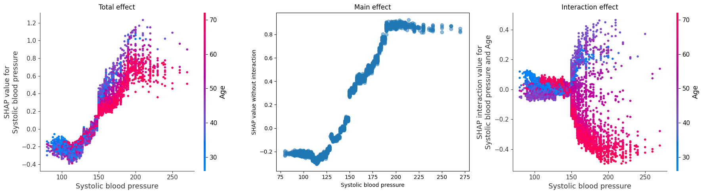
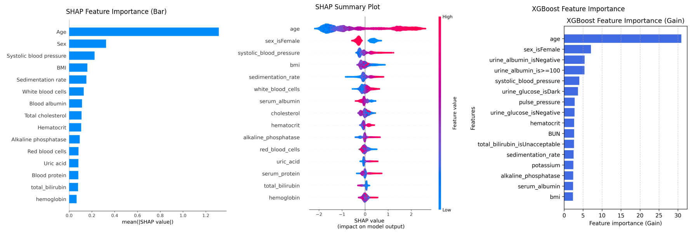

# TreeShap

# 🎯 **Goals of the Repo**  

This repo (see `xai_protein_modified.ipynb`) aims to **reproduce the results** of the paper  
📖 *Explainable AI for Trees: From Local Explanations to Global Understanding* by **S.M. Lundberg et al. (2020)**.  

It leverages some code from [this repository](https://github.com/suinleelab/treeexplainer-study) and focuses **exclusively** on the **NHANES I dataset**, which is one of the three datasets used in the original study.  

---

## **Outline**  

🔹 **1. Data Loading** – Load the dataset following the original approach.  
🔹 **2. Problem Exploration** – Understand key features and distributions.  
🔹 **3. Model Training** – Train:  
   - 🌳 an **XGBoost model**  
   - 📉 a **linear model**  
   *(Hyperparameter tuning via **RandomSearch**)*
   
🔹 **4. Algorithm Implementation** – Code Algorithm 1 (Explainer) **from scratch**.  
🔹 **5. SHAP Comparison** – Compare our implementation with `TreeExplainer` from the **SHAP** library.  
🔹 **6. Complexity Analysis** – Evaluate **computational efficiency**.  
🔹 **7. Dependence Plots** – Analyze **feature dependencies & interactions**.  
🔹 **8. Global vs. Local SHAP** – Compare **SHAP values** with the **Gain method**.  

---
## **Main Results**

### 🔄 Feature Interactions: Systolic BP & Age

SHAP allows decomposition of feature contributions into **main effects** and **interaction effects**. Below we analyze how **systolic blood pressure** influences mortality risk depending on **age**.

  

- **Left**: Total SHAP effect (main + interaction), colored by age.
- **Middle**: Isolated main effect of systolic BP.
- **Right**: Interaction term between systolic BP and age.

🎯 **Interpretation**: High systolic blood pressure increases mortality risk **mainly for younger patients**. For older individuals, the effect may plateau or even reverse — revealing a strong interaction.

---

### SHAP vs Gain: Global Feature Importance

To move from **local explanations** to a **global understanding**, we aggregated SHAP values over the entire NHANES I dataset and compared the results with classical XGBoost **Gain-based** feature importance.

  

- **SHAP bar plot (left)** ranks features by their average impact on model output.
- **SHAP summary plot (middle)** shows both importance and directionality (positive/negative impact).
- **Gain plot (right)** lacks directionality and overemphasizes features that appear deeper in the tree.

🔑 **Key Insight**: While Gain highlights `age`, SHAP confirms this and adds interpretability by showing *how* and *for whom* features matter.
